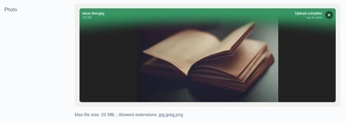

# SilverStripe FilePond module


[](https://scrutinizer-ci.com/g/lekoala/silverstripe-filepond/)
[](https://codecov.io/gh/lekoala/silverstripe-filepond)

## Intro

Allow usage of [FilePond](https://pqina.nl/filepond/) fields in the front end.

Use as a regular UploadField and let it do its magic!

```php
$pond = new FilePondField('Image');
```

## File extension

In order for this uploader to work properly, your files need to have a IsTemporary boolean field.
This is provided by the FilePondFileExtension class.

```yml
SilverStripe\Assets\File:
  extensions:
    - LeKoala\FilePond\FilePondFileExtension
LeKoala\FilePond\FilePondField:
  enable_auto_thumbnails: true
```

You can of course implement your own extension. As a bonus, you can toggle the `enable_auto_thumbnails`
to `true` in order to get thumbnails for images in the cms.

## Thumbnails

If your project already includes `silverstripe/asset-admin` then thumbnails - if configured as above - will just work as expected.

If you have no need for `silverstripe/asset-admin` and wish to implement your own thumbnail generator, then it can be configured like so in your project's YML config:

```
LeKoala\FilePond\FilePondFieldExtension:
  dependencies:
    thumbnailService: '%$\Path\To\My\ThumbnailGenerator'
```

**Note:** Your `ThumbnailGenerator` class needs to declare the familliar `generateThumbnail()` method in order to work.

## Temporary files

Because files are upload in ajax, maybe they will never be used if the user never submit the form.

In order to avoid storing unecessary files, all files uploaded are flagged by default as `IsTemporary`.

All files are then unflagged as `IsTemporary` when the form is submitted and saved into a record.

Although this should all work automatically, if you manually use the FilePondField without saving into
a record you need to manually unflag the files yourself.

By default, old temporary files are deleted automatically by the FilePondField::clearTemporaryUploads method.
You can control how often files are deleted based on your upload frequencies (see `auto_clear_threshold`).
Since the files are deleted on upload, it might take some time if you have a lot of files to delete.
This is disabled by default and you need to enable it with `auto_clear_temp_folder` set to `true`

If that's the case, maybe it's better to run a cron task every 5 minutes that calls this method in order
to avoid burdening the end user. Have a look at my [simple jobs module](https://github.com/lekoala/silverstripe-simple-jobs) to do that.

## Tracking files

Most of the time, uploaded files are linked to a record. The primary mechanism of moving uploaded files out of the `IsTemporary` state is
done through the `FilePondField::saveInto` method.

In order to maximize tracking, the `FilePondFileExtension` also add `ObjectID` and `ObjectClass` fields to the `File` table.

This allows to associate files easily to your `DataObject` classes without adding specific `has_many` or `many_many` relations, which either create extra tables or required reciprocal relationships.

Instead, while moving files out of `IsTemporary` state, we also associate the current form record to the file.

## Configuring field instances

This module configure FilePondFields based on a config data attribute. It will generate most of the config by itself, however
you can customize frontend behaviour with the following method:

```php
$pond->addFilePondConfig('allowDrop', false);
```

Please refer to FilePond documentation to see what are the public properties.

## Poster images

You can enable dedicated plugins

```yml
LeKoala\FilePond\FilePondField:
  enable_image: true
  enable_poster: true
  enable_auto_thumbnails: true
```

These modules enable poster support to display nices images attached to the upload field



## Validation, resizing and croping

### For files

By default, this module validate file size and file extension in the front end thanks to the FilePond plugins.

You can read more here:

https://pqina.nl/filepond/docs/patterns/plugins/file-validate-size/
https://pqina.nl/filepond/docs/patterns/plugins/file-validate-type/

### For images

We also installed the image size validation, resize and crop plugins. This allows to avoid user uploading incorrect format that might be difficult
to crop or resize (GD crashing anyone?).

You can define custom image sizes on your records based on convention. For example, for a squared avatar and a large image.

```yml
MyRecord:
  image_sizes:
    Avatar: [512,512,'max']
    SquareImage: [512,512,'crop']
    LargeImage: [1080,1080]
```

Parameters are width, height. You can set a 3rd parameter to:
- 'min' to ensure the file is above this size (default if no value is specified).
- 'max' to ensure the file is below this size.
- 'crop' to crop the file to this ratio (keep the largest image possible matching this ratio).
  - Example : Setting 512,512 means a squared ratio (effectively, this is 1:1)
- 'resize' resize the file to this size (keeps aspect ratio of the file).
- 'crop_resize' crop and resize the file to this size (use our set aspect ratio).

Image manipulations happen on the client side, the file that gets sent to the server will have the configured
size. Very useful to deal with large images or avoiding scaling files after upload.

If defined, the field description and the validation will be automatically applied.

You can also use the `setImageSize` method directly on the uploader instance with similar parameters.

```php
$fields->replaceField("Photo", $Photo = new FilePondField("Photo"));
$Photo->setImageSize(300, 200, 'crop');
```

You can read more here:

https://pqina.nl/filepond/docs/patterns/plugins/image-validate-size/
https://pqina.nl/filepond/docs/api/plugins/image-resize/
https://pqina.nl/filepond/docs/api/plugins/image-crop/

## Renaming and organizing files

One thing is certain, your user tends to name files incorrectly. The end result is that your asset folder
is full of stuff with crazy names.

In order to bring some sanity to your asset folder, this module work in two ways.

### Default folder

The default behaviour from SilverStripe is to upload everything in the Uploads folder. But wouldn't it be more useful to organize things based on your class ? Project files go to Project folder. Sounds good?

Great, because this is exactly how it works.

By default, if a record is associated to the form, all files will be uploaded to NameOfTheClass/NameOfTheUploader.

This behaviour is fully configurable. If your `DataObject` implements a `getFolderName` method, you can retain paths based on your own logic (for example NameOfTheClass/IDOfTheRecord).
By default, I don't recommend to store files based on records IDs because : 1. IDs are not known for new records, 2. If you have lots of records, you will have lots of folders that are slow to parse and display.

### Renaming files according to a pattern

Let's say your users can upload avatars. But it wouldn't be too good to allow crazy names in a public facing website right?

Don't worry, I'm here to help:

```php
$pond = new FilePondField('Avatar');
$pond->setRenamePattern("{field}_{date}.{extension}");
```

By setting a rename pattern, you can rename dynamically the files *before they are saved to the asset store* (which is really great).

The following pattern will rename the file to Avatar_yyyymmdd.jpg. You can also set static parts, for example:

```php
$pond = new FilePondField('Avatar');
$pond->setRenamePattern($member->Username . "_avatar.{extension}");
```

You can also use the built-in Filepond renamer like this. Files will be renamed in the frontend before being upload to the server:

```php
$pond = new FilePondField('Avatar');
$pond->setRenameFile('my_avatar_' . time());
```

## Chunked uploads

If you need to upload large videos, you can use `setChunkUploads`. File will be uploaded in chunks (size is computed automatically based on server settings) and then merged on the last upload.

```php
$fields->push($Video = new FilePondField("Video"));
$Video->setChunkUploads(true);
```

You can also enable this globally with `chunk_by_default`.

## Requirements

In order to provide a working out of the box experience, Filepond is provided as a custom element imported from
https://github.com/lekoala/formidable-elements

## Custom server config

If for some reason you use a custom endpoint for your FilePond, you can use the `setCustomServerConfig`. You can pass
an array of options (for simple configs) or a string that should be the name of a global js handler.

## Config flags

FilePondField has the following configurable options

```yml
LeKoala\FilePond\FilePondField:
  auto_clear_temp_folder: true
  auto_clear_threshold: null #defaults to 1 day in prod env
  enable_default_description: true
  enable_requirements: true
  enable_poster: false
  chunk_by_default: false
  enable_auto_thumbnails: true
  poster_width: 352
  poster_height: 264
```

## Todo

- More tests and refactoring

## Sponsored by

This module is kindly sponsored by [RESTRUCT](restruct.nl)

## Compatibility

Tested with 4.5 to 4.13 but should work on any 4.x projects

## Maintainer

LeKoala - thomas@lekoala.be
